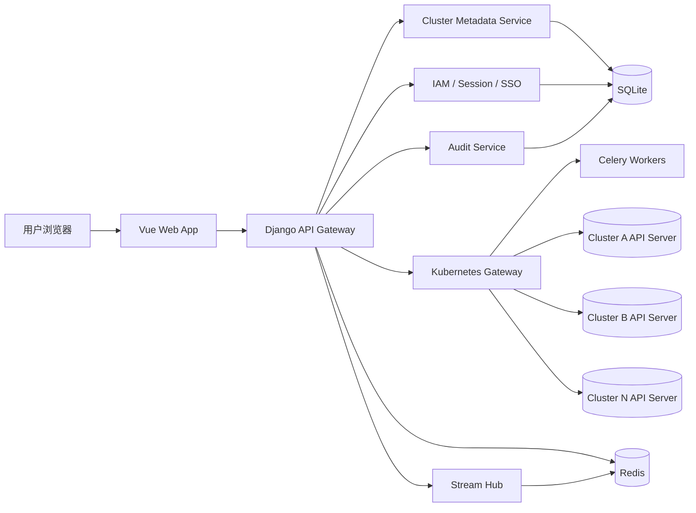
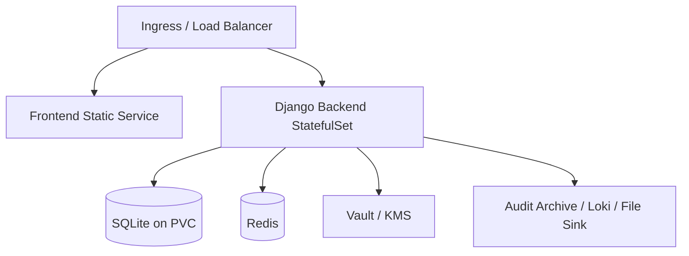

# Kuboard 系统架构设计

## 1. 总体架构目标

Kuboard 的架构目标是：

- 前后端彻底分离
- 高性能、高可靠、易扩展
- 严格遵循 Kubernetes API 规范
- 对多集群和多用户访问做统一治理
- 兼容内置资源与 CRD

推荐采用“模块化单体 + 流式网关 + 异步任务”的演进式架构。V1 先保持一个可控的 Django 后端代码仓，但内部边界清晰，后续可按压力拆分。

## 2. 技术选型

### 2.1 前端

- Vue 3
- TypeScript
- Vite
- Vue Router
- Pinia
- Naive UI 或 Headless 组件 + 自研 Design Token
- Monaco Editor
- ECharts
- SSE / WebSocket 客户端

### 2.2 后端

- Python 3.12+
- Django 4.2 LTS+
- Django REST Framework
- Django ASGI 部署
- Celery
- Redis
- SQLite
- Kubernetes Python Client + 必要时补充原生 HTTP 调用

说明：

- SQLite 只用于 Kuboard 系统元数据，如用户、集群接入信息、配置和审计索引
- Redis 承担缓存、会话、限流、队列和部分流式协调能力
- Kubernetes 资源对象本身不落本地数据库，仍然实时来自目标集群 API

### 2.3 基础设施

- Nginx / Envoy 作为入口层
- Helm 作为部署方式
- Prometheus + Grafana
- Loki / ELK
- OpenTelemetry
- Vault 或 KMS 用于密钥管理

## 3. 逻辑架构



## 4. 架构分层

### 4.1 前端层

职责：

- 登录、路由、导航、页面渲染
- 集群/命名空间/资源维度的状态组织
- YAML 与表单编辑体验
- 实时事件流消费
- 按权限动态裁剪 UI

前端不直接访问 Kubernetes API，也不保存集群凭证。

### 4.2 API Gateway 层

职责：

- 统一 API 入口
- 会话鉴权
- 参数校验
- 限流与审计
- 聚合多个内部模块的返回结果

这一层对前端暴露稳定的 `/api/v1/...` 协议，对内编排 IAM、集群元数据、Kubernetes Gateway 和流式服务。

### 4.3 Kubernetes Gateway 层

这是 Kuboard 的核心。

职责：

- 动态发现集群 API 资源
- 统一封装 list / get / watch / create / patch / apply / delete
- 处理多集群连接、凭证、超时、重试、限流
- 处理 Kubernetes Subject 映射与 impersonation
- 为前端返回统一格式的资源列表、详情、错误、冲突信息

设计原则：

- 不把资源固化为 Django Model
- 不为每一种 Kubernetes 资源手写一套后端接口
- 以内置资源 + CRD 通用化为第一原则

### 4.4 Stream Hub

职责：

- 聚合 Watch、Logs、Exec、Events 等流式能力
- 复用相同资源维度的后端 Watch 连接
- 把单个集群连接扇出到多个前端订阅者
- 处理断线重连、BOOKMARK、resourceVersion 恢复

建议使用 Django ASGI + 专门的流式模块处理，也可以在后续演进为独立 stream service。

### 4.5 异步任务层

职责：

- 集群导入后的探测与初始化
- 周期性同步 API 发现与 OpenAPI 缓存
- 审计日志归档
- 连接健康检查
- 长耗时操作与重试任务

### 4.6 元数据存储层

职责：

- 保存系统元数据、接入配置、用户组关系、审计索引
- 保持最小必要持久化，不把集群资源镜像到本地
- 在 SQLite 模式下通过 WAL、快照备份和恢复校验保证可用性

设计约束：

- SQLite 不适合高写入、多节点共享写场景
- 因此高频状态必须外置到 Redis 或日志系统
- 需要对后台写操作做批处理、削峰和失败补偿

## 5. 后端模块拆分建议

| 模块 | 主要职责 |
| --- | --- |
| `apps.iam` | 用户、组、登录、OIDC、LDAP、会话管理 |
| `apps.clusters` | kubeconfig 导入、集群元数据、健康检查、能力探测 |
| `apps.k8s_gateway` | Kubernetes 资源统一访问层 |
| `apps.rbac_bridge` | 用户到 Kubernetes Subject 的映射、权限探测 |
| `apps.streams` | Watch、Logs、Exec、Terminal 流式服务 |
| `apps.audit` | 审计事件采集、查询、导出 |
| `apps.settings` | 系统配置、密钥配置、开关与策略 |
| `apps.extensions` | 插件注册、扩展点、前端扩展清单 |

## 6. 多集群接入设计

### 6.1 集群导入

输入：

- kubeconfig 文件
- 集群别名、环境标签、描述
- 可选的默认访问策略

导入时执行：

1. 结构合法性校验
2. kubeconfig 风险项扫描
3. API Server 连通性验证
4. 证书校验
5. 获取 Kubernetes 版本
6. 拉取 API 发现信息
7. 拉取 OpenAPI v3 文档索引
8. 验证是否具备 impersonation 方案所需能力

### 6.2 kubeconfig 安全策略

必须落实以下规则：

- 默认拒绝带有 `exec` 认证插件的 kubeconfig，避免后端执行任意命令
- 默认拒绝 `insecure-skip-tls-verify`
- 对 `auth-provider`、代理配置、外部证书路径做严格校验
- 入库存储前加密敏感字段
- 凭证解密只发生在真正发起集群调用时

### 6.3 集群凭证存储

建议模型：

- `Cluster`
- `ClusterCredential`
- `ClusterCapability`
- `ClusterHealthStatus`

安全要求：

- kubeconfig 原文不直接明文存储
- token、client cert、client key 分字段加密
- 使用 KMS / Vault 托管主密钥

## 7. 多用户与 Kubernetes RBAC 设计

### 7.1 推荐方案：身份映射 + Impersonation

推荐模式：

1. 平台管理员导入具备受控 impersonation 能力的集群凭证
2. Kuboard 用户登录后，系统计算其 Kubernetes 用户名和组
3. 后端发起 Kubernetes 请求时附加 `Impersonate-User` 和 `Impersonate-Group`
4. 集群最终依据自身 RBAC 作授权决策

这样做的好处：

- 权限来源清晰
- 不用为每个 Kuboard 用户都保存一份 kubeconfig
- 前后端权限表现能与真实集群一致
- 方便接入 OIDC / LDAP 用户组

### 7.2 Subject 映射规则

建议支持三类映射：

- 用户直映射：`kuboard.user.email -> k8s username`
- 组映射：`kuboard.group -> k8s groups[]`
- 模板映射：如 `tenant:{tenant_slug}:admins`

### 7.3 权限探测

前端页面加载时，后端对关键能力执行：

- `SelfSubjectAccessReview`
- 必要时补充 `SelfSubjectRulesReview`

应用方式：

- 控制左侧资源树显示范围
- 控制页面按钮是否可点
- 控制后端请求是否允许继续执行

## 8. Kubernetes API 兼容设计

这是整个系统最重要的设计约束。

### 8.1 通用资源模型

后端不把 Deployment、Service、ConfigMap 等都建成本地业务表，而是统一抽象为：

- Cluster
- Group
- Version
- Resource
- Namespace
- Name
- Scope
- Raw Object

### 8.2 Discovery + OpenAPI 驱动

建议通过以下能力驱动前后端：

- 发现可用 API Group/Version/Resource
- 获取资源是 Namespaced 还是 Cluster Scoped
- 获取 Kind、ShortNames、Categories
- 拉取 OpenAPI v3 schema
- 生成表单、字段说明、校验提示

### 8.3 写操作约束

- Create: 原生 POST
- Replace: 原生 PUT
- Patch: 支持 JSON Patch / Merge Patch / Strategic Merge Patch
- Apply: 优先支持 Server-Side Apply
- Delete: 原生 DELETE

关键要求：

- 默认带 `fieldManager=kuboard`
- 支持 `dryRun=All`
- 返回冲突字段信息
- 尊重 `resourceVersion`

### 8.4 列表与 Watch

列表请求：

- 支持 `limit/continue`
- 使用 `resourceVersionMatch=NotOlderThan`
- 大列表默认分页

Watch 请求：

- 使用 `allowWatchBookmarks=true`
- 保存并推进 `resourceVersion`
- 处理 `410 Gone` 重建 watch
- 高并发场景下由服务端汇聚复用

### 8.5 Exec / Logs / Attach

由于 Kubernetes Python Client 的 stream 调用会影响底层连接协议，建议：

- 为 logs/exec/attach 使用独立的流式客户端实例
- 不复用普通 CRUD 的 `ApiClient`
- 将流式链路与通用资源访问链路隔离

## 9. API 设计建议

### 9.1 对前端暴露的核心接口

```text
POST   /api/v1/auth/login
POST   /api/v1/auth/logout
GET    /api/v1/me

GET    /api/v1/clusters
POST   /api/v1/clusters
GET    /api/v1/clusters/{clusterId}
POST   /api/v1/clusters/{clusterId}/health-check
GET    /api/v1/clusters/{clusterId}/discovery
GET    /api/v1/clusters/{clusterId}/openapi/index

POST   /api/v1/clusters/{clusterId}/permissions/check
POST   /api/v1/clusters/{clusterId}/permissions/rules

GET    /api/v1/clusters/{clusterId}/resources/{group}/{version}/{resource}
GET    /api/v1/clusters/{clusterId}/resources/{group}/{version}/{resource}/{name}
POST   /api/v1/clusters/{clusterId}/resources/{group}/{version}/{resource}
PATCH  /api/v1/clusters/{clusterId}/resources/{group}/{version}/{resource}/{name}
PUT    /api/v1/clusters/{clusterId}/resources/{group}/{version}/{resource}/{name}
DELETE /api/v1/clusters/{clusterId}/resources/{group}/{version}/{resource}/{name}

POST   /api/v1/clusters/{clusterId}/apply
GET    /api/v1/clusters/{clusterId}/watch
GET    /api/v1/clusters/{clusterId}/logs
GET    /api/v1/clusters/{clusterId}/events
POST   /api/v1/clusters/{clusterId}/exec/sessions
```

### 9.2 返回格式建议

- 保留 Kubernetes 对象原始结构
- 在外层补充 UI 需要的元信息
- 错误格式统一包含：
  - `code`
  - `message`
  - `details`
  - `k8s_status`
  - `trace_id`

## 10. 数据模型建议

| 实体 | 说明 |
| --- | --- |
| `User` | 系统用户 |
| `Group` | 用户组 |
| `UserGroupMembership` | 用户与组关系 |
| `Cluster` | 集群主记录 |
| `ClusterCredential` | 加密凭证 |
| `ClusterCapability` | API 能力、版本、特性 |
| `SubjectMapping` | Kuboard 用户/组 到 K8s Subject 映射 |
| `SavedView` | 用户保存的常用筛选视图 |
| `FavoriteResource` | 收藏资源 |
| `AuditEvent` | 审计记录 |
| `SystemSetting` | 系统配置项 |
| `FeatureFlag` | 功能开关 |

补充建议：

- `AuditEvent` 只保存可检索摘要，详细内容可落外部日志或对象存储
- Session、权限探测缓存、短期流式会话不要落 SQLite

## 11. SQLite 方案设计

### 11.1 适用范围

- 适合单实例或轻量级 Kuboard 控制平面
- 适合中低频元数据写入场景
- 不适合多副本后端共享同一个 SQLite 文件并同时高并发写入

### 11.2 推荐运行方式

- 后端采用单个 StatefulSet 或单机进程组运行
- API、Worker、Stream 建议共享同一持久卷和同一 SQLite 文件
- 前端仍可单独部署和独立扩缩

### 11.3 参数与维护建议

- 开启 WAL 模式
- 配置合理的 `busy_timeout`
- 定期执行备份、校验和必要的 VACUUM
- 审计明细采用异步归档，避免把 SQLite 变成高频日志写库

### 11.4 演进边界

- 当用户数、审计写入量、后台任务并发明显增大时，需要准备迁移到 PostgreSQL
- 因此 ORM 模型、仓储层和审计存储接口要尽量避免绑定 SQLite 特性

## 12. 部署架构建议



部署建议：

- Web 前端可独立部署和缓存加速
- SQLite 模式下后端建议单实例部署，避免多写冲突
- SQLite 数据文件使用持久卷保存，并做定时快照和异地备份
- Redis 用于缓存、限流、队列、流式订阅协调和会话状态
- 审计明细建议同步输出到 Loki、文件或对象存储

## 13. 性能设计

### 13.1 前端性能

- 路由级懒加载
- 列表虚拟滚动
- 大对象分块渲染
- OpenAPI / Discovery 结果本地缓存

### 13.2 后端性能

- ASGI 部署提升流式处理能力
- Redis 缓存集群发现信息、OpenAPI 索引、权限探测结果
- 按集群维度做连接池、限流和熔断
- Watch 多路复用
- 重资源查询做分页和字段裁剪
- 减少 SQLite 高频写入，把会话、缓存和临时状态迁出数据库
- 审计写入采用异步批量归档

### 13.3 集群侧保护

- 对同一资源的 Watch 连接做服务端复用
- 限制高频轮询
- 设置请求超时、重试退避、最大并发
- 对大对象列表启用压缩与分页

## 14. 可靠性设计

### 14.1 可用性

- Web 无状态化
- 后端单实例 + 持久卷 + 健康检查
- 关键异步任务支持重试和失败补偿
- 提供冷备节点或快速重建流程

### 14.2 一致性

- Django 元数据写入走事务
- 资源写操作依赖 Kubernetes 原生一致性语义
- 冲突以 Kubernetes API 返回为准，不自行伪造冲突解决逻辑
- 编辑前后要检查 `resourceVersion` 与 managed fields，防止覆盖他人改动

### 14.3 故障恢复

- 集群连接失败时不拖垮主服务
- 使用熔断器隔离故障集群
- SQLite 文件和密钥材料定时备份
- 审计日志异步归档 + 可补偿
- Watch 断流可自动恢复

### 14.4 SQLite 特有边界

- 单机文件损坏是核心风险，必须有快照、校验和恢复演练
- 多进程高频写入会放大锁竞争，需限制写放大场景
- 不建议把 SQLite 放在不稳定的共享网络文件系统上

## 15. 安全设计

### 15.1 身份认证

- 支持本地账号
- 推荐接入 OIDC
- 企业场景支持 LDAP
- 支持会话过期、可选 MFA、设备管理

### 15.2 访问控制

- 后端接口采用 DRF 权限类
- 集群资源权限以 Kubernetes RBAC 为最终准绳
- 管理类接口与资源访问接口分离

### 15.3 敏感数据保护

- Secret 默认脱敏
- Secret 与 `binaryData` 分离展示，下载与复制需要更高权限
- kubeconfig、token、client key 加密存储
- 审计日志中不记录明文凭证

### 15.4 安全边界

- 不允许前端直连集群
- 不允许导入可执行任意本地命令的 kubeconfig 而不经审核
- 对 Web Terminal、Exec、Logs 设置更严的审计和超时
- 对 Session、Exec、Terminal 连接设置 TTL、空闲回收和并发限制

## 16. 可观测性设计

平台自身至少输出三类信号：

- Metrics：请求耗时、错误率、每集群调用量、watch 数量、队列堆积
- Logs：结构化应用日志、流式会话日志、失败详情
- Traces：跨 API Gateway、Kubernetes Gateway、Worker 的调用链

审计维度建议记录：

- 谁在什么时间访问了哪个集群
- 对哪个资源执行了什么操作
- 操作是否成功
- 请求 trace id

## 17. 版本兼容与升级策略

- 通过 discovery 和 capability probe 判断集群是否支持目标功能
- 为不同 Kubernetes 次版本维护兼容矩阵与降级说明
- 升级 Kuboard 前先备份 SQLite 文件、加密密钥和系统配置
- 升级流程必须包含数据库完整性检查和回滚步骤

## 18. 测试策略

- 单元测试：权限映射、kubeconfig 校验、资源路径拼装、错误处理
- 集成测试：对接 kind / k3d 集群验证 CRUD、Watch、RBAC、SSA
- 端到端测试：登录、集群导入、资源编辑、日志查看
- 压测：大列表、Watch 扇出、并发权限探测
- 恢复演练：SQLite 备份恢复、密钥恢复、审计索引恢复

## 19. 关键架构决策总结

1. 采用前后端分离，而不是服务端模板渲染
2. 后端以 Django 为核心，但必须使用 ASGI 运行形态
3. 资源访问采用“通用网关”而不是“每种资源单独编码”
4. 权限采用“Kuboard 登录 + Kubernetes RBAC 最终裁决”
5. 多用户访问推荐用 impersonation 映射，而不是保存每个用户自己的 kubeconfig
6. 写操作优先支持 Server-Side Apply
7. 实时数据优先采用服务端聚合 Watch，而不是前端粗暴轮询
8. 当前版本采用 SQLite 保存系统元数据，并通过 Redis 与外部归档分担高频状态和审计写入

## 20. 参考链接

- Django ASGI Deployment  
  https://docs.djangoproject.com/en/6.0/howto/deployment/asgi/
- Django Cache Framework  
  https://docs.djangoproject.com/en/6.0/topics/cache/
- Django Database Transactions  
  https://docs.djangoproject.com/en/4.1/topics/db/transactions/
- Kubernetes Python Client  
  https://github.com/kubernetes-client/python
- Kubernetes API Concepts  
  https://kubernetes.io/docs/reference/using-api/api-concepts/
- Kubernetes RBAC  
  https://kubernetes.io/docs/reference/access-authn-authz/rbac/
- Kubernetes User Impersonation  
  https://kubernetes.io/docs/reference/access-authn-authz/user-impersonation/
- Kubernetes SelfSubjectAccessReview  
  https://kubernetes.io/docs/reference/kubernetes-api/authorization-resources/self-subject-access-review-v1/
- Kubernetes kubeconfig v1  
  https://kubernetes.io/docs/reference/config-api/kubeconfig.v1/
